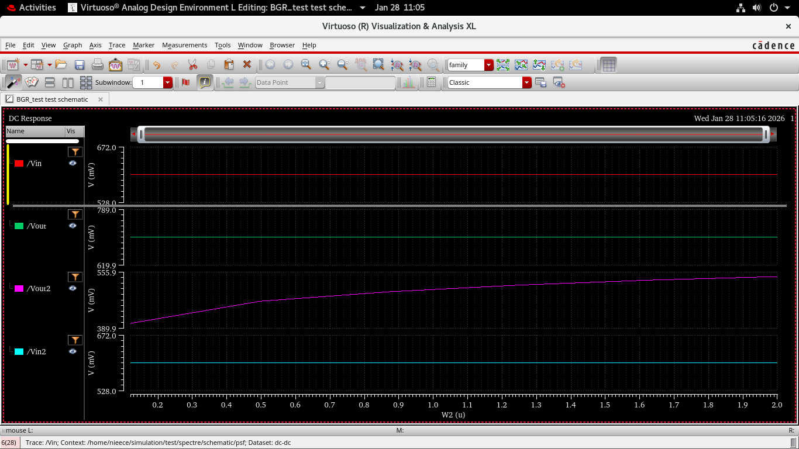
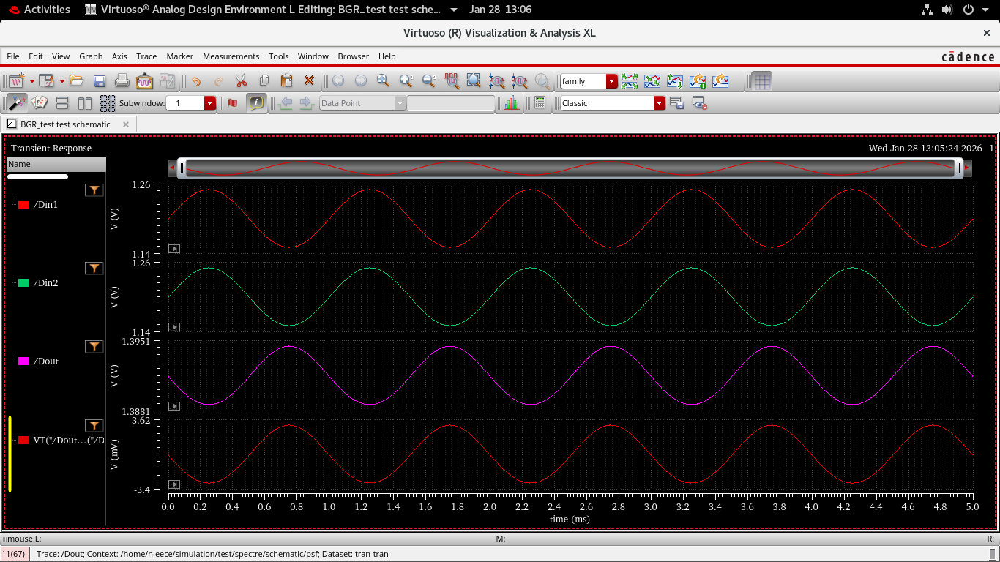
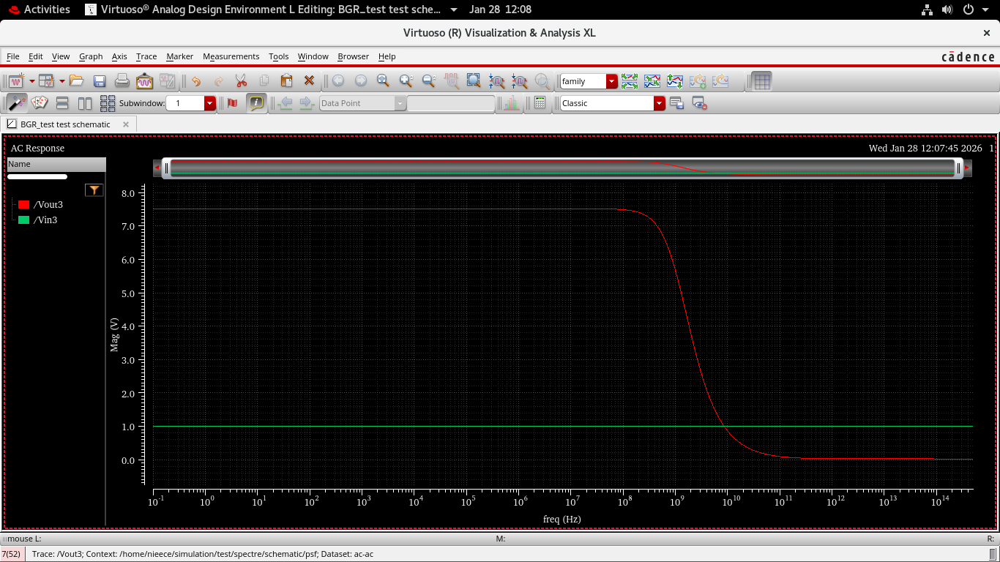
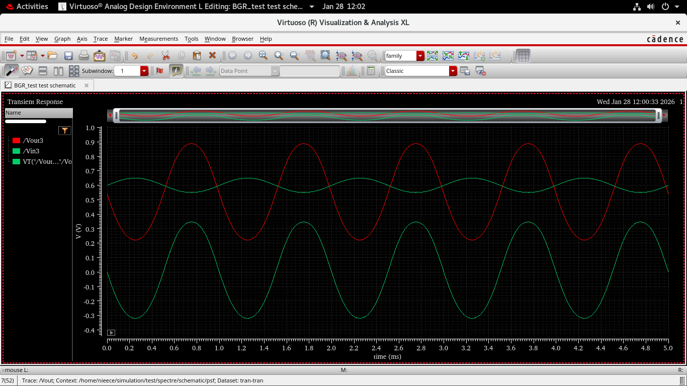

# Day 2 – Differential Amplifier and OTA Design Using Cadence Virtuoso

## Objective
The objective of Day 2 was to design and analyze a MOS differential amplifier and extend it into an Operational Transconductance Amplifier (OTA). Emphasis was placed on differential operation, biasing, small-signal gain, frequency response, transient behavior, and symbol-level testing.

---

## Tools Used
- Cadence Virtuoso Schematic Editor  
- Cadence Virtuoso ADE L  
- Spectre Simulator  

---

## 1. Differential Amplifier – Transistor Level

### Circuit Description
A MOS differential amplifier was implemented using NMOS input transistors with a PMOS current mirror active load. A constant tail current source biases the differential pair, enabling differential input operation.

### Differential Amplifier Schematic

---

## 2. DC Analysis

DC operating point analysis was performed to verify correct biasing and region of operation of all transistors.

### Observations
- NMOS input devices operate in saturation region.
- Tail current is approximately **30–35 µA**.
- Input common-mode voltage is around **600 mV**.
- Output DC level is approximately **1.35–1.40 V**.
- Current mirror load maintains balanced biasing.

### DC Analysis Plot

---

## 3. AC Analysis

AC small-signal analysis was performed to evaluate the differential gain and bandwidth.

### Observations
- Low-frequency voltage gain ≈ **6.5–7 V/V** (≈ **16.3 dB**).
- Gain roll-off observed beyond **~1 GHz**.
- Dominant pole behavior indicates stable operation.
- Differential operation shows higher gain compared to single-ended stage.

### AC Analysis Plot

---

## 4. Transient Analysis

Transient analysis was performed by applying differential sinusoidal inputs.

### Observations
- Input signals **Din1** and **Din2** are equal in magnitude and 180° out of phase.
- Output waveform shows amplified differential response.
- Output peak-to-peak voltage ≈ **70–90 mV**.
- Proper current steering observed between the differential branches.

### Transient Analysis Plot

---

## 5. Circuit Variations and Comparisons

### Circuit 2

- DC bias remains stable across device sizing.
- AC gain ≈ **3–3.5 V/V**.
- Bandwidth improves compared to Circuit 1.

#### Circuit 2 Analysis
  

---

### Circuit 3

- Increased device width improves transconductance.
- DC output shifts slightly due to higher bias current.
- AC gain ≈ **7–8 V/V**.
- Bandwidth slightly reduced due to increased parasitic capacitances.

#### Circuit 3 Analysis
  

---

## 6. Symbol Creation

A schematic symbol was created for the OTA to enable hierarchical design and easy reuse.

### OTA Symbol

---

## 7. Symbol-Level Testbench

The OTA symbol was instantiated in a separate testbench for validation.

### Observations
- Differential inputs Vinp and Vinn applied through AC sources.
- DC bias voltages:  
  - VDD ≈ **1.8 V**  
  - VSS = **0 V**
- Output response matches schematic-level simulations.

### Symbol Testbench

---

## Day 2 Summary
- Designed and analyzed a MOS differential amplifier.
- Verified correct DC biasing and saturation operation.
- Achieved differential gain of approximately **6–8 V/V**.
- Studied frequency response and bandwidth limitations.
- Performed transient analysis to observe current steering.
- Created and tested an OTA symbol for hierarchical design.

---
