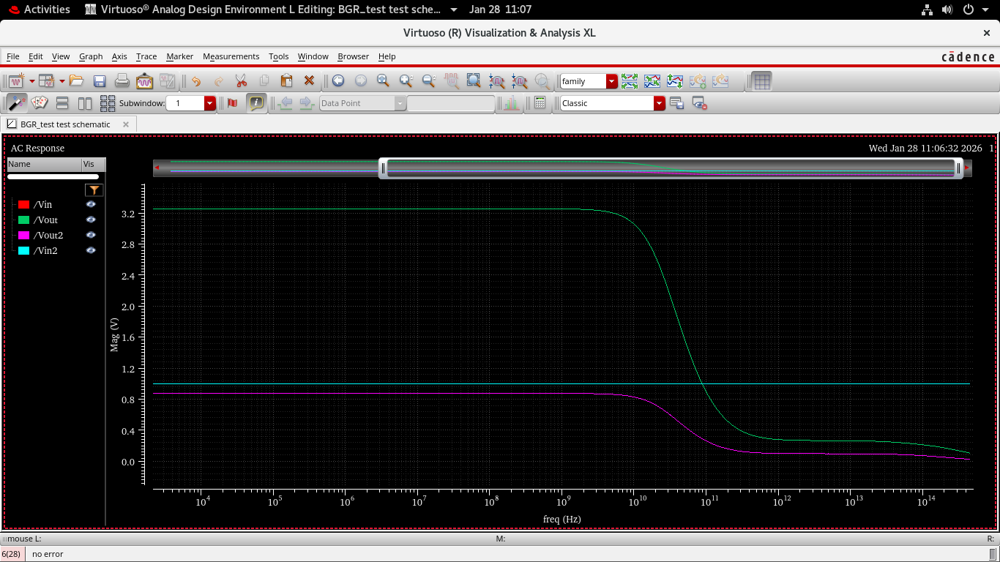
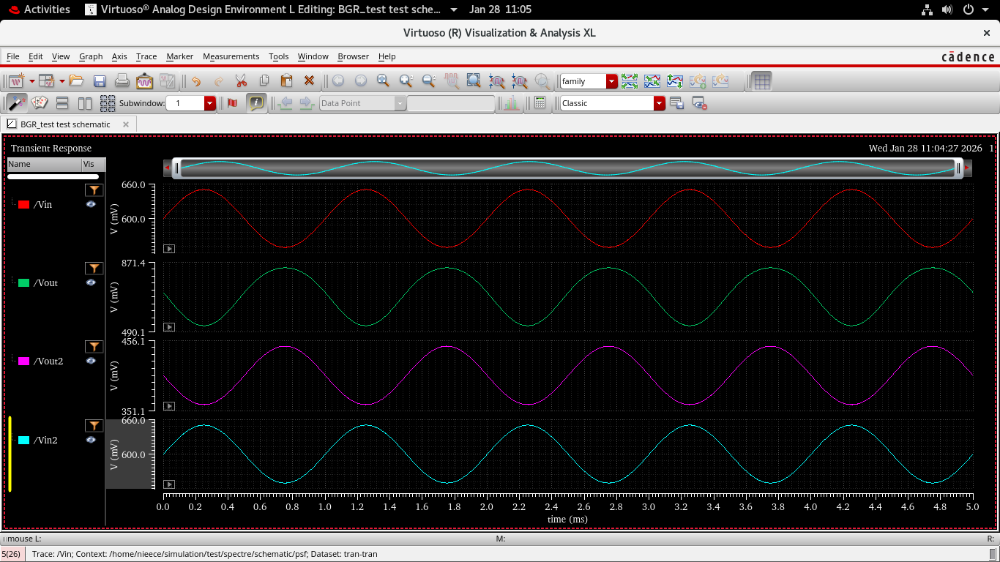
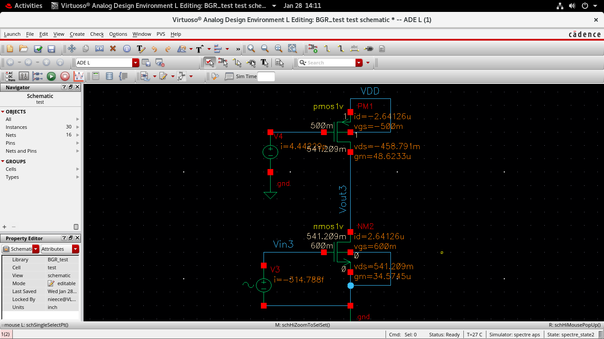
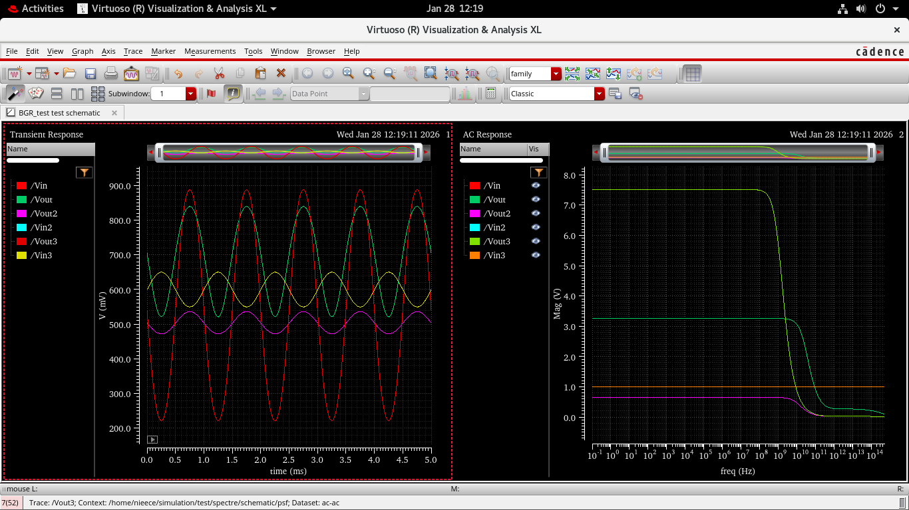
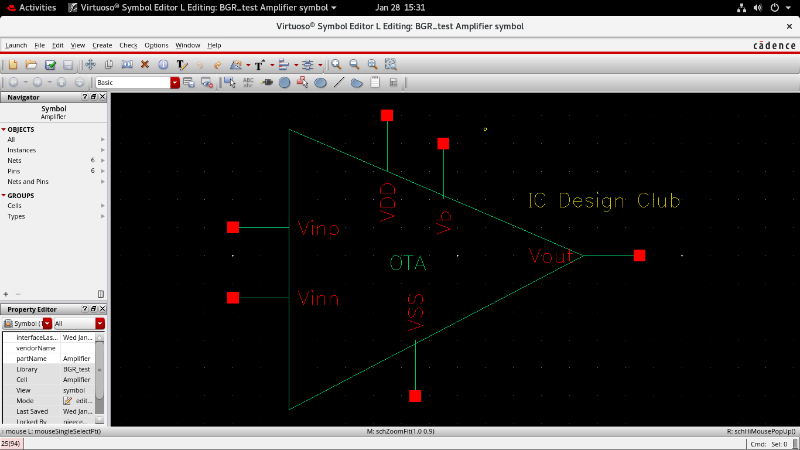
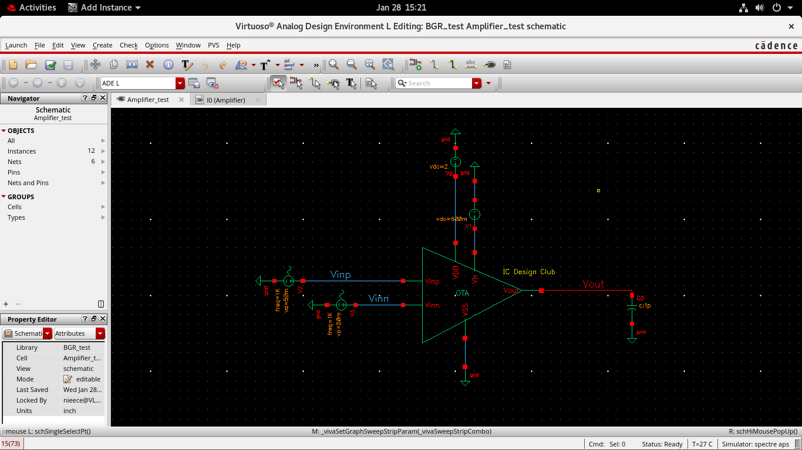

#  Day 2 – Differential Amplifier and OTA Design Using Cadence Virtuoso

## Objective
The objective of Day 2 was to design and analyze a MOS differential amplifier and extend it into an Operational Transconductance Amplifier (OTA). Emphasis was placed on differential operation, biasing, small-signal gain, frequency response, transient behavior, and symbol-level testing.

---

## Tools Used
- Cadence Virtuoso Schematic Editor  
- Cadence Virtuoso ADE L  
- Spectre Simulator  

---

## 1. Differential Amplifier – Transistor Level

### Circuit Description
A MOS differential amplifier was implemented using NMOS input transistors with a PMOS current mirror active load. A constant tail current source biases the differential pair, enabling differential input operation.

### Differential Amplifier Schematic

---

## 2. Adding Ports and Hierarchical Setup

Ports were added to the differential amplifier to enable hierarchical design and facilitate symbol creation and testing.

### Adding Ports

---

## 3. DC Analysis

DC operating point analysis was performed to verify correct biasing and region of operation of all transistors.

### Observations
- NMOS input devices operate in the saturation region.
- Tail current is approximately **30–35 µA**.
- Input common-mode voltage is around **600 mV**.
- Output DC level is approximately **1.35–1.40 V**.
- PMOS current mirror ensures balanced biasing.

### DC Analysis Plot (Circuit 2)

---

## 4. AC Analysis

Small-signal AC analysis was performed to evaluate the gain and bandwidth of the differential amplifier.

### Observations
- Low-frequency differential gain ≈ **6.5–7 V/V** (≈ **16–17 dB**).
- Gain roll-off observed beyond approximately **1 GHz**.
- Dominant pole response indicates stable operation.

### AC Analysis Plot (Differential)

---

## 5. Transient Analysis

Transient analysis was performed by applying sinusoidal differential inputs (equal amplitude, 180° phase shift).

### Observations
- Proper current steering between differential branches observed.
- Output waveform shows amplified differential response.
- Output peak-to-peak voltage ≈ **70–90 mV**.

### Differential Transient Response

---

## 6. Circuit Variations

### Circuit 2

- DC operating point remains stable.
- AC gain ≈ **3–3.5 V/V**.
- Improved bandwidth compared to basic configuration.

#### Circuit 2 Analysis
  

---

### Circuit 3

- Increased device width improves transconductance.
- Slight DC output shift due to higher bias current.
- AC gain ≈ **7–8 V/V**.
- Bandwidth slightly reduced due to increased parasitic capacitances.

#### Circuit 3 Analysis
  

---

## 7. Combined Circuit View

---

## 8. Symbol Creation

A schematic symbol was created for the OTA to enable hierarchical design and reuse in higher-level circuits.

### OTA Symbol

---

## 9. Symbol-Level Testbench

The OTA symbol was instantiated in a separate testbench to validate its functionality.

### Observations
- Differential inputs Vinp and Vinn applied correctly.
- Supply voltages: **VDD ≈ 1.8 V**, **VSS = 0 V**.
- Output response matches schematic-level simulations.

### Symbol Testbench

---

## Day 2 Summary
- Designed and analyzed a MOS differential amplifier.
- Verified DC biasing and saturation operation.
- Achieved differential gain of approximately **6–8 V/V**.
- Studied AC frequency response and transient behavior.
- Created and validated an OTA symbol for hierarchical design.

---
